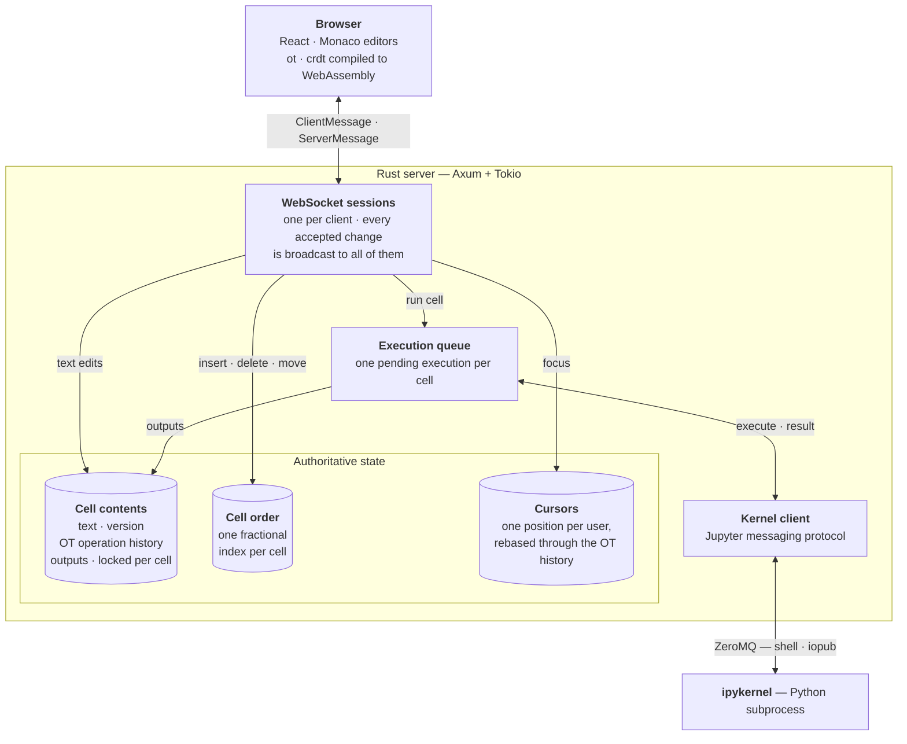

<div align="center">
  
  <h1>Crab Collab</h1>
  <p><em>A real-time collaborative Jupyter notebook, written in Rust.</em></p>
</div>

Crab Collab is a multi-user computational notebook: several people open the same
notebook in their browser, edit cells at the same time, see each other's cursors,
and run Python code against a shared Jupyter kernel.

The interesting part is *how* concurrent edits are reconciled. A notebook is not a
single document — it is an **ordered list of cells**, each of which contains **its own
text buffer**. Those two things have very different concurrency characteristics, so
Crab Collab deliberately uses a different strategy for each:

| State | Strategy |
| --- | --- |
| Cell text | **Operational Transformation** — server-authoritative, per-cell version space |
| Cell order | **Fractional indexing** — CRDT-flavoured, order emerges from the indices themselves |
| Cursors / presence | Positions rebased through the same OT operation history |
| Execution | Single shared kernel, server-side queue keyed by cell |

Both families of algorithm coexist in one system, and the boundary between them
falls exactly on the boundary between the two kinds of state.
[**docs/conflict-resolution.md**](docs/conflict-resolution.md) explains how.

---

## Features

- **Concurrent text editing** with optimistic local application and server-side transformation
- **Concurrent structural edits** — insert, delete and reorder cells without stepping on each other
- **Live presence** — participant list, per-user colours, remote cursors rendered inside Monaco
- **Python execution** against a real `ipykernel` process over ZeroMQ, with streamed stdout/stderr, results and tracebacks broadcast to everyone
- **Markdown and code cells**, Monaco-backed editing, GFM rendering
- **One implementation of the algorithms**, shared by client and server — the OT and fractional-index crates compile both natively and to WebAssembly

## Architecture



Clients apply their own edits immediately and send them on. The server is the single
authority, so every change comes back through the same broadcast — including to the client
that sent it, for which the echo is the acknowledgement that confirms its local guess.

### Crates

| Crate | Responsibility |
| --- | --- |
| `crates/server` | Axum WebSocket server, wire protocol, message handlers, presence/focus tracking |
| `crates/notebook` | Authoritative notebook state and conflict resolution |
| `crates/ot` | Text operations, transform / compose / apply, cursor rebasing (native + wasm) |
| `crates/crdt` | `FractionalList` — a fractional-index-ordered list (native + wasm) |
| `crates/execution_queue` | Tracks in-flight executions, maps kernel messages back to cells |
| `crates/kernel` | Launches `ipykernel`, speaks the Jupyter messaging protocol over ZeroMQ, HMAC-SHA256 signing |

`ot` and `crdt` are the shared core: the server links them natively, and `wasm-pack`
builds the same crates into `frontend/src/wasm/`, so the browser transforms operations
with byte-identical logic instead of a re-implementation that has to be kept in sync.

## Getting started

**Prerequisites**

- Rust (2024 edition; developed on 1.96)
- `wasm-pack` and the `wasm32-unknown-unknown` target — `cargo install wasm-pack && rustup target add wasm32-unknown-unknown`
- [Bun](https://bun.sh)
- Python 3 with `ipykernel` — `pip install ipykernel`

**Run the server** (listens on `0.0.0.0:3000`, WebSocket endpoint `/ws`; launches its own kernel process):

```bash
cargo run -p server
```

**Run the frontend** (builds the wasm crates, then starts Vite with a wasm watcher):

```bash
cd frontend
bun install
bun run dev
```

Open the printed URL in two browser windows, pick a name in each, and edit the same cell.
The WebSocket URL is configured via `VITE_WS_BASE_URL` in `frontend/.env.development`.

**Tests**

```bash
cargo test
```

## Repository layout

```
crates/          Rust workspace (see table above)
frontend/        React client; frontend/src/wasm/ is generated by wasm-pack
scripts/         wasm-build.sh — builds a crate into frontend/src/wasm/<crate>
docs/            conflict-resolution.md — how concurrent edits converge
                 proposal.md            — the original project proposal
```

## Scope

Deliberately **not** implemented, to keep the focus on synchronization:

persistence (sessions are in-memory and ephemeral) · authentication · multiple notebooks or
workspaces · multiple or non-Python kernels · rich outputs beyond text (images, widgets,
plots) · offline editing · `.ipynb` import/export.

The architecture leaves room for all of them; none of them are needed to study how
concurrent notebook edits converge.

## Further reading

- [How conflict resolution works](docs/conflict-resolution.md) — the design in full, plus the
  papers and articles it draws on
- [The original project proposal](docs/proposal.md)
- [Jupyter messaging protocol](https://jupyter-client.readthedocs.io/en/stable/messaging.html)
